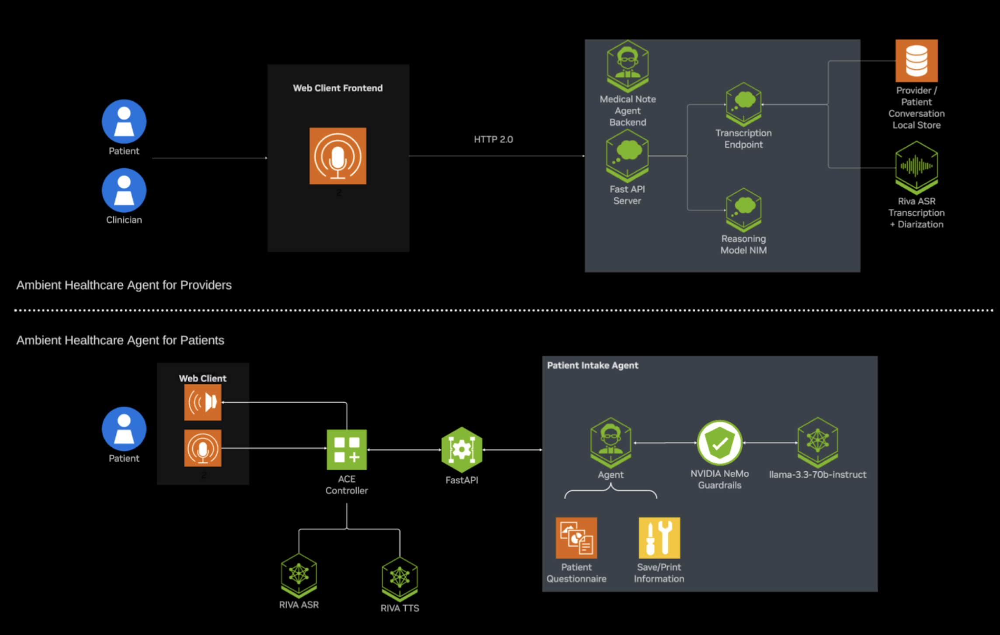

# Ambient Healthcare Agents Developer Example

**Build advanced AI agents for providers and patients using this developer example powered by NeMo Microservices, NVIDIA Nemotron, Riva ASR and TTS, and NVIDIA LLM NIM**

> ⚠️ **Third-Party Software Notice**  
> This developer example will download and install additional third-party open source software projects.  
> Please review the license terms of these open source projects before use.

---

## Overview

Healthcare, the world's largest customer service sector, faces urgent pressure to digitize patient and provider interactions. Ambient voice AI is key, however, the next leap will come from Generative AI reasoning models—these will enable voice agents to provide intelligent, context-aware responses, automate documentation, and deliver highly personalized care, fundamentally transforming clinical workflows and scaling efficient, accurate healthcare delivery.

This developer example provides developers with the ingredients to build and scale such agents with two primary use cases:

### **Ambient Provider Voice Agent**
Does more than transcribe patient-provider conversations. It understands context, infers intent, and generates nuanced, structured clinical documentation—such as SOAP notes—autonomously, reducing manual input and supporting better clinical decisions.

### **Ambient Patient Voice Agent**
Manages high-volume patient touchpoints (e.g., clinic intake, surveys, appointment scheduling, information queries) without clinician involvement. Its ability to reason dynamically allows for more personalized, empathetic patient interactions and real-time problem-solving within complex healthcare contexts.

---

## Architecture

*Figure: System architecture showing integration of NeMo Microservices, NVIDIA Nemotron, Riva ASR & TTS, and LLM NIM for provider and patient voice agents.*

---

## Key Features

### **Ambient Provider Agent**

- **Advanced Transcription**
  - Riva transcription with speaker diarization and medical terminology lexicon boosting
  - Parakeet ASR for real-time diarized transcription
  - Support for both live conversations and retrospective analysis

- **Fast Medical Reasoning**
  - Llama Nemotron reasoning capabilities deliver highest accuracy and lowest latency
  - Automated analysis of transcripts for clinical documentation
  - Autonomous SOAP note generation

### **Ambient Patient Agent**

- **Comprehensive Speech Pipeline**
  - Riva speech-to-text and text-to-speech capabilities
  - Parakeet 1.1b ASR Model for low-latency accurate transcription
  - Magpie Multilingual TTS Model for natural voice audio responses

- **Intelligent Guardrails**
  - NeMo Guardrails for safe and topically appropriate interactions
  - Context-aware response generation
  - Multi-language support

---

## Software Components

### **NVIDIA Technologies**
- **llama-3.3-nemotron-super-49b-instruct** - Advanced reasoning model
- **llama-3.3-70b-instruct** - Instruction-following model for agent orchestration
- **NemoGuard Content Safety Model** - Guardrail Content safety model
- **NemoGuard Topic Control Model** - Guardrail Topic control model
- **Riva Magpie TTS** - Text-to-speech synthesis
- **Riva Parakeet ASR** - Automatic speech recognition
- **NVIDIA ace-controller** - Voice AI Service orchestration

### **Additional Software**
- **LangChain** & **Langgraph** - Framework for Agentic LLM applications
- **Tavily** - Web search and information retrieval

---

## System Requirements

### **Minimum Requirements**

> **Note:** Users may have to wait 5–10 minutes for the instance to start, depending on cloud availability.

#### **Operating System & System Software**
- **Ubuntu 22.04**
- **Docker Version 28.1+ with Docker Compose plugin**

#### **Storage**
- **Ambient Patient Agent:** 300 GB (for self-hosted configuration)
- **Ambient Provider Agent:** 325 GB (for self-hosted configuration)

### **Hardware Requirements**

#### **Ambient Provider Agent**

**Self-Hosted Configuration:**
| Service | Use Case | Recommended GPU |
|---------|----------|-----------------|
| Riva ASR Microservice | Audio Transcription and Diarization | 1x various options including L40, A100, and more (see [modelcard](https://build.nvidia.com/nvidia/parakeet-ctc-1_1b-asr/modelcard)) |
| Reasoning Model | Medical Note (SOAP) Generation | 2x H100 80 GB *or* 4x A100 80 GB |

**NVIDIA API Catalog Configuration:** No GPU requirement when using public NVIDIA endpoints for NIM microservices (build.nvidia.com)

#### **Ambient Patient Agent**

**Self-Hosted Configuration:**
| Service | Use Case | Recommended GPU |
|---------|----------|-----------------|
| Riva ASR Microservice | Speech-to-Text Transcription | 1x various options including L40, A100, and more (see [modelcard](https://build.nvidia.com/nvidia/parakeet-ctc-1_1b-asr/modelcard)) |
| Riva TTS Microservice | Text-to-Speech Generation | 1x various options including L40, A100, and more (see [modelcard](https://build.nvidia.com/nvidia/parakeet-ctc-1_1b-asr/modelcard)) |
[NemoGuard Content Safety Model](https://build.nvidia.com/nvidia/llama-3_1-nemoguard-8b-content-safety/modelcard) (Optional for Enabling NeMo Guardrails) | `nvidia/llama-3_1-nemoguard-8b-content-safety` | 1x options including A100, H100, L40S, A6000
[NemoGuard Topic Control Model](https://build.nvidia.com/nvidia/llama-3_1-nemoguard-8b-topic-control/modelcard) (Optional for Enabling NeMo Guardrails) | `nvidia/llama-3_1-nemoguard-8b-topic-control` | 1x options including A100, H100, L40S, A6000
| Instruct Model | Agent Reasoning and Tool Calling | 2x H100 80 GB *or* 4x A100 80GB |

**NVIDIA API Catalog Configuration:** No GPU requirement when using public NVIDIA endpoints for NIM microservices (build.nvidia.com)

---

## Deployment Options

- **Docker Compose** - Containerized deployment
- **NVIDIA API Catalog Endpoints** - Using NVIDIA's hosted services [build.nvidia.com](https://build.nvidia.com).
- **Self-Hosted** - Local GPU deployment

### **Quickstart**
For a quickstart, refer to the [ambient-provider](./ambient-provider/ambient-provider.ipynb) and [ambient-patient](./ambient-patient/ambient-patient.ipynb) Python notebooks, which demonstrate setup and usage.

---

## Deploying on NVIDIA Brev

For a streamlined cloud deployment experience, you can deploy the Ambient Healthcare Agents developer example on NVIDIA Brev using a preconfigured GPU Environment Template (Launchable) [here](http://brev.nvidia.com).

---

## Ethical Considerations

NVIDIA believes Trustworthy AI is a shared responsibility, and we have established policies and practices to enable development for a wide array of AI applications. When downloaded or used in accordance with our terms of service, developers should work with their supporting model team to ensure the models meet requirements for the relevant industry and use case and addresses unforeseen product misuse. 

For more detailed information on ethical considerations for the models, please see the Model Card++ Explainability, Bias, Safety & Security, and Privacy Subcards. 

**Report Issues:** Please report security vulnerabilities or NVIDIA AI Concerns [here](https://www.nvidia.com/en-us/support/submit-security-vulnerability/).

---

## License and Terms of Use

### **License**
Use of the models in this developer example is governed by the **NVIDIA AI Foundation Models Community License**.

### **Governing Terms**
- **NVIDIA Ambient Healthcare Agents Developer Example:** Apache 2.0 License
- **Software and Materials:** NVIDIA Software License Agreement and Product-Specific Terms for NVIDIA AI Products
- **Models (except Llama-3.3-Nemotron-Super-49B-v1.5):** NVIDIA Community Model License
- **Llama-3.3-Nemotron-Super-49B-v1.5 Model:** NVIDIA Open Model License Agreement
- **Llama-3.3-70b-Instruct Model:** Llama 3.3 Community License Agreement

---